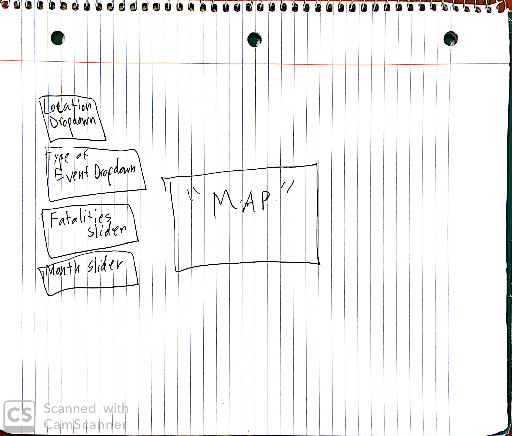

## Group Members  
Here is a list of our group members  
- Amogh Bhoopalam ( *amoghb2* )  
- Anna Wysocka (annamw2)  
- Daniel Cherny ('chrnykh2')  
- Josh Janda ('joshlj2')  
- Sophia Ding ('yuxid2')  

## Tentative Title  
NOAA Event Weather Viewer

## The Dataset

https://www.ncdc.noaa.gov/data-access/severe-weather

## Summary of the intentions and goals of the project 

We are making visualizations of the locations where weather events occur within the United States of America. We will allow users of the application to select specific subsets of the weather event dataset too, to allow them to create the visualization that they want.  
The specific factors that we may look at are:
- Location
  - State Level
  - Coordinate Level (where it exists)
- Type of Event
- Property Damage
- Human Fatalities
- Month occurred
- Start/End time

An example visualization users can create is a map of Flash Floods in Iowa that caused property damage.

## Storyboard

The US has a very diverse climate and so we want to show off just how diverse it really is. While most people already have an idea of the weather events that occur in a certain region, we wanted to confirm or deny peoples' preconceived notions through the use of data. 

An example of what our graph may look like:

For example:

You may be surprised where it snows. Our tool will be able to show you where all in the US it actually snows. 

Here is a mockup of the tool:

